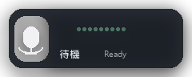
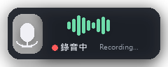

# Overlay 圖示 — 三款設計 mockup 比較

產生時間：2026-05-01 12:04
來源腳本：[`tools/design_mockups.py`](../../tools/design_mockups.py)
目前 overlay 實作：[`src/zen_type/core/overlay.py`](../../src/zen_type/core/overlay.py)
目前 tray 實作：[`src/zen_type/core/tray_icons.py`](../../src/zen_type/core/tray_icons.py)

> 一張總覽圖：[`contact_sheet.png`](contact_sheet.png)

---

## 為什麼要重做

使用者回饋現有 overlay「感覺圖示沒有很漂亮」。問題拆解：

1. **層次扁平**——背景靠透明色 chroma key，沒有卡片邊框、陰影，整體像「貼在桌面上的兩塊色塊」而不是一個 widget。
2. **元件分離感**——左邊圓圈 + mic、右邊綠色長條 + 下方色塊狀態，三個區塊各自為政，沒有統一容器。
3. **波形單薄**——只往上長的細條、無圓角、顏色偏螢光，與整體暖色調不搭。
4. **mic 形狀粗糙**——當前是 rectangle + oval 拼出來，邊緣有銳角。
5. **狀態文字 pill 邊框生硬**——`outline="#6b5140"` 1px 線條，沒有融進整體。

三款 mockup 各自針對以上痛點提出不同解法。

---

## A · Modern Minimalist

> Dark card · mint 對稱波形 · iOS 控制中心風

| | |
|---|---|
| Idle  |  |
| Recording |  |
| Tray (idle / rec) |   |

- **配色**：近黑卡片（`#1c2028` 半透明）+ mint 綠（`#6edca0`）波形。
- **波形**：上下對稱、圓角 2px，視覺中心對齊文字基線。
- **mic**：placed 在小型半透明 disc 內，淺色描邊。
- **狀態列**：紅點 + 中文狀態 + 英文 sub-label（`Recording…`）橫排，資訊密度高但不擠。
- **適合**：偏好沉穩、現代、與 macOS/iOS 系統 widget 一致的使用者。
- **缺點**：不再保留現有 zen-type 的暖色調 brand 感。

---

## B · Warm Polished

> 保留現有暖色 vibe，加陰影 / 圓角 / 高光

| | |
|---|---|
| Idle  |  |
| Recording |  |
| Tray (idle / rec) |   |

- **配色**：奶油 card + butter/terracotta disc，跟現有調色板**完全相容**。
- **新增**：top highlight（白色半透明橢圓）讓 disc 看起來有立體感、整張卡片有陰影。
- **波形**：暖綠（`#6eb45a`）符合整體調性，圓角 2px。
- **狀態 pill**：仍在底部，但去掉硬邊框、改用同色填滿。
- **適合**：想保留 zen-type 暖色品牌但提升質感的使用者。
- **缺點**：尺寸最大（220×80），佔桌面空間略多。

---

## C · Pill Horizontal

> 細長膠囊，波形為主視覺

| | |
|---|---|
| Idle  |  |
| Recording |  |
| Tray (idle / rec) |   |

- **形狀**：完整圓角膠囊（240×56），Spotify mini-player 那種感覺。
- **mic**：縮成左側小 disc（IDLE 灰、RECORDING 紅）。
- **波形**：占整個中間區域，最大、最戲劇化的視覺元素。
- **狀態文字**：右側兩字短標籤（待機 / 錄音中）。
- **Tray icon**：改用圓角方形而非圓形，跟 Windows 11 圖示語言更一致。
- **適合**：偏好低干擾、橫向窄條、不擋桌面的使用者。
- **缺點**：垂直方向資訊量最少；錄音中的紅 disc 可能與系統其他通知爭奪注意力。

---

## 規格對照

| | A Modern | B Warm | C Pill |
|---|---|---|---|
| 尺寸 | 220×76 | 220×80 | 240×56 |
| 圓角 | 18px card | 18px card | 半圓 (28px) |
| 主配色 | 深色 + mint | 奶油 + butter/terracotta | 深色 + mint |
| 波形 | 對稱 9 條 | 對稱 9 條 | 對稱 11 條 |
| Tray 形狀 | 圓形 | 圓形（高光） | 圓角方形 |
| 與現有調色板 | 完全替換 | 完全相容 | 完全替換 |
| 桌面佔位 | 中 | 中 | 低（垂直） |

---

## 下一步

請從 A/B/C 三款選一款（或指出特定元素的混搭，例如「B 的配色 + C 的形狀」）。
我會把選定設計寫進 [`overlay.py`](../../src/zen_type/core/overlay.py) 與
[`tray_icons.py`](../../src/zen_type/core/tray_icons.py)，並重 build exe。

> mockup 腳本本身（[`tools/design_mockups.py`](../../tools/design_mockups.py)）
> 不影響執行檔，可隨時刪除或保留作為以後快速產生新 mockup 的工具。
